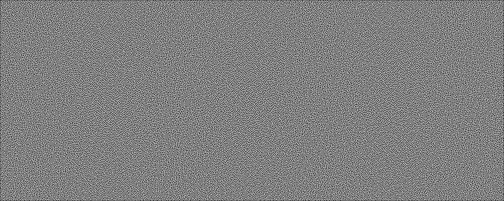

# Maze Generation

My attempts at generating mazes using random algorithms. Using the [image](https://github.com/image-rs/image) package to generate the mazes into images.

[](./maze.png)

---

## Generation

The generation is done using [Randomised Depth First Search](https://en.wikipedia.org/wiki/Maze_generation_algorithm#Randomized_depth-first_search). This generates a complete maze with a guaranteed path from anywhere in the maze to anywhere else in the maze.

I have some code to allow for the maze to be different sizes and generate with various sized borders, cells & gaps. However the pathfinding has ignored this feature completely.

## Pathfinding

As mentioned this feature has ignored all generation options I added. Pretty much to get the best results, 1px cell, border & gap + a square maze. There is some quirks that I am yet to look at or fix with oddly shaped mazes.

I've added 2 searching algorithms to solve the maze.

1. BFS - Breath First Search
2. A*

To generate the graph for the maze I used a graph builder I wrote [here](https://github.com/adrocodes/crude-graph). It is by no means performant or production ready, but it works for what I need.

A node in the graph is essentially any cell that **isn't** a corridor. A corridor is a cell with walls on top & bottom and none to the side or the opposite, walls on the sides and none top & bottom. This results in a graph of nodes at intersections, corners and dead ends. That is enough for the search algorithms to do their thing. The graph is also a undirected graph - probably not ideal, but it works.

Something else to keep in mind, Randomised DFS results in a graph that is complete but doesn't have a lot of branching and there is pretty much only 1 solution. So the path difference between the two searching algorithmns is minimal.

## Usage

This isn't a library so you'll need to clone the project and edit the messy `main.rs` file.

At the top there are some config values. Tweak the `MAZE_SIZE` to your maze of choice. I've only done up to 5000x5000, so any value above that is your problem. Going past 1000x1000, running `cargo build --release` and running the release is recommended if you value your time. It isn't super slow, but it isn't _BLAZINGLY FAST_ (I am new to this).

Furthur down the file you'll encounter this masterpiece:

```rust
// let path = &graph.bfs(STARTING_SPOT, ENDING_SPOT);

// if let Some(path) = path {
//     println!("Path found - drawing solution");
//     println!("Path length: {}", path.len());

//     draw_solution(image, &path, ENDING_SPOT);
// }

graph.astar(
    STARTING_SPOT,
    ENDING_SPOT,
    &manhattan_distance,
    &distance_fn,
);
let path = graph.get_path();

println!("Path found - drawing solution");
println!("Path length: {}", path.len());

draw_solution(image, &path, ENDING_SPOT);
```

I implemented the two widely different so you'll have to tweak some code to get it to work as expected.

To run `BFS` - uncomment the commented code and comment out the rest.

To run `A*` - leave as is.

Next hit run and a `maze.png` will be created with your maze and the solution drawn.

If you don't want the solution drawn, then you can comment literally everything after this line near the top of the main function.

```rust
println!("Maze saved");
```

## Stats

_Each were tested on the same maze of any given size_

_`Nodes checked`_ is a very crude "`i++`" during the search, probably not super accurate.

### 100x100

| Numbers | BFS | A* |
|---|---|---|
| No of Nodes | 6,918 | 6,918 |
| Nodes checked | 3,783 | 3,059 |
| Path Length | 3,788 | 3,066 |

### 1000x1000

| Numbers | BFS | A* |
|---|---|---|
| No of Nodes | 697,389 | 697,389 |
| Nodes checked | 279,472 | 269,356 |
| Path Length | 279,486 | 269,373 |

### 5000x5000

| Numbers | BFS | A* |
|---|---|---|
| No of Nodes | 17,450,756 | 17,450,756 |
| Nodes checked | 15,660,672 | 15,632,465 |
| Path Length | 15,660,679 | 15,632,476 |